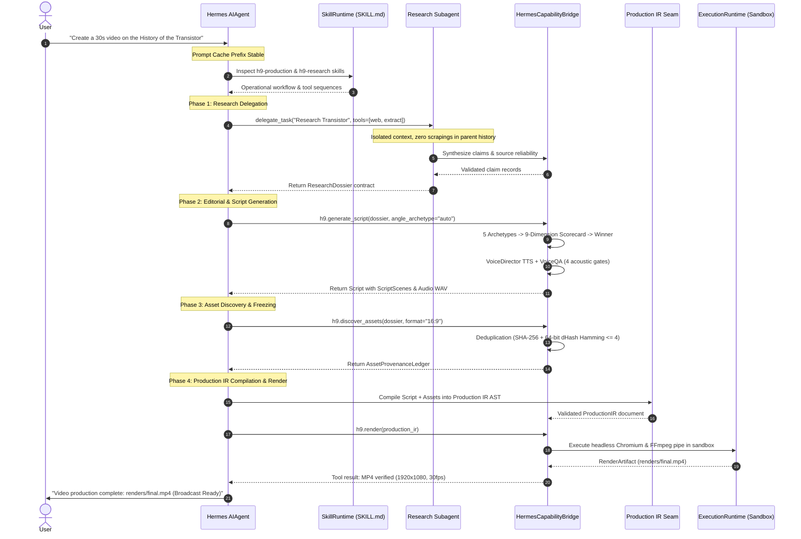

# Hermes Agent & Harness 9 Runtime Coupling Architecture Audit

**Document ID:** H9-ARCH-001  
**Author:** worker_m1_dev (Teamwork Preview Engineering)  
**Status:** Approved Architectural Specification & Runtime Boundary  
**Branch:** `dev`  
**Date:** 2026-09-04  
**Target Milestone:** Milestone 1 (Architecture Audit & Runtime Boundary Interface)

---

## 1. Executive Summary & Problem Statement

Harness 9 (H9) is an autonomous, deterministic content production operating system capable of transforming raw conceptual briefs into broadcast-ready rendered MP4 video through a strict 17-state lifecycle. In its initial Milestone 1 architecture, Harness 9 operated as an external execution monolith invoked solely through high-level tool wrappers (`generate_video_from_brief`, `inspect_production_state`, `evaluate_content_quality`) under an isolated adapter facade (`adapters/hermes/`).

While this legacy coupling preserved backward compatibility and protected per-conversation prompt caching, it introduced severe architectural bottlenecks:
1. **Monolithic Black-Box Execution:** The entire production pipeline ran inside a single synchronous, blocking tool call lasting 30–60+ seconds. The parent Hermes Agent could not inspect intermediate state, intervene, or steer creative choices during research, editorial angle selection, or scriptwriting.
2. **Context Bloat & Token Waste:** If an error occurred in late-stage rendering, the entire pipeline had to be re-triggered from scratch, with raw logs spilled into the tool result.
3. **Subagent & Capability Isolation Deficit:** Multi-source research was performed in-process rather than being delegated to an isolated child agent (`delegate_task`), risking context leakage and tool pollution.
4. **Hardcoded Inference & Memory Duplication:** Domain modules relied on static heuristics or procedural fallbacks rather than routing requests through Hermes's logical capability roles and shared memory infrastructure.

This document establishes the authoritative architecture audit and runtime boundary interface specification (`src/h9_runtime/`) to refactor Harness 9 so that its content-production capabilities run directly through the full Hermes Agent runtime (agent loop, context engineering, skills, tools, MCP, provider/model routing, memory, subagents, permissions, sandbox, and cron) without duplicating or breaking either runtime.

---

## 2. In-Depth Audit of Execution Paths

### 2.1 Hermes Agent Native Execution Paths

Hermes is a personal AI agent core operating across CLI, messaging gateways (Telegram, Discord, Slack, etc.), TUI, and Electron desktop. The core runtime architecture is defined by:

1. **AIAgent Conversation Loop (`run_agent.py`):**
   - Implements synchronous turn execution with interrupt checking, iteration budgets, and tool call handling.
   - Preserves **sacred per-conversation prompt caching**: byte-stable system prompt prefix, strict message role alternation (`user` -> `assistant (tool_calls)` -> `tool (tool_results)` -> `assistant`), and immutable history.
   - 4-breakpoint prompt caching (`agent/prompt_caching.py`): Breakpoint 1 on stable system prefix (`DEFAULT_AGENT_IDENTITY`), Breakpoint 2 on system end + tool definitions, Breakpoints 3 & 4 on last two conversation turns.
   - Single-turn grace call allowing model summarization when iteration budget is exhausted.

2. **Tool Registry & Footprint Ladder (`tools/registry.py`, `toolsets.py`):**
   - Core tools (`_HERMES_CORE_TOOLS`) are sent on every API turn across all platforms and sessions.
   - Capabilities are governed by the Footprint Ladder:
     * Rung 1: Extend existing code.
     * Rung 2: CLI command + skill (zero model tool footprint).
     * Rung 3: Service-gated toolset (`check_fn`, TTL-cached availability probe).
     * Rung 4: Plugin (`~/.hermes/plugins/`).
     * Rung 5: MCP server in catalog.
     * Rung 6: Core tool (last resort).
   - Tool execution supports dynamic search (`tool_search`), async execution via worker event loops, and bounded JSON error output.

3. **Skills Progressive Disclosure Standard (`tools/skills_tool.py`, `skills/`):**
   - 3-tier progressive disclosure:
     * Tier 1: Skill index metadata in system prompt (`name`, `description`, `platforms`).
     * Tier 2: On-demand instruction loading (`SKILL.md` via `skill_view(skill_name)`).
     * Tier 3: Supporting references, templates, and scripts (`skill_view(skill_name, subpath)`).
   - Strict YAML frontmatter with tags, platform constraints, and operational workflows.

4. **Model & Provider Routing (`agent/auxiliary_client.py`, `agent/provider_projection.py`):**
   - Multi-provider abstraction (Anthropic, Gemini, OpenAI, Bedrock, Vertex, Codex, Ollama, DeepSeek).
   - Dedicated auxiliary client for background reflection, evaluation, and summarization without corrupting main session context.

5. **Memory & State Persistence (`agent/memory_manager.py`, `agent/memory_provider.py`):**
   - Single-external-provider architecture via `MemoryProvider` ABC (prefetch, system prompt blocks, turn sync).
   - Local SQLite `SessionDB` (`hermes_state.py`) with FTS5 full-text search across session transcripts.

6. **Subagent Delegation (`tools/delegate_tool.py`):**
   - Isolated child `AIAgent` instances spawned with clean conversation history and dedicated `task_id`.
   - Stripped blocked tools (`DELEGATE_BLOCKED_TOOLS`: `delegate_task`, `clarify`, `memory`, `send_message`).
   - Automated denial of dangerous shell commands (`_subagent_auto_deny`) to prevent deadlocking unattended background tasks.

7. **Execution Environments & Sandboxing (`tools/environments/base.py`):**
   - `BaseEnvironment` interface supporting `LocalEnvironment`, `DockerEnvironment`, `ModalEnvironment`, `SingularityEnvironment`, `SSHEnvironment`.
   - Streaming output capture via `_BoundedOutputCollector` (40/60 head-tail window, disk spillover up to 5MB).

8. **Permissions & Security Guardrails (`tools/approval.py`, `agent/tool_guardrails.py`):**
   - Pattern-based dangerous command detection and approval gating (`allow`, `deny`, `once`).
   - Session allowlisting and capability scoping.

9. **Model Context Protocol (MCP) Integration (`tools/mcp_tool.py`):**
   - Built-in MCP client supporting stdio, SSE, and Streamable HTTP transports.
   - Dynamic registration of MCP server tool catalogs into `mcp-*` toolsets.

10. **Task Scheduling & Cron (`cron/scheduler.py`, `cron/jobs.py`):**
    - High-precision recurring crons and one-shot timer schedules.
    - Background task tracking via `manage_task`.

---

### 2.2 Harness 9 Domain Execution Paths

Harness 9 automates multimedia content production through four core pipelines governed by a strict 17-state deterministic lifecycle machine:

1. **Production Lifecycle State Machine (`src/orchestrator/state_machine.py`):**
   - 17 canonical states:
     `CREATED` -> `RESEARCH_PLANNED` -> `RESEARCH_IN_PROGRESS` -> `RESEARCH_COMPLETED` ->
     `EDITORIAL_ANALYSIS` -> `ANGLE_SELECTED` -> `OUTLINE_APPROVED` -> `SCRIPTING_IN_PROGRESS` ->
     `SCRIPT_COMPLETED` -> `VOICE_GENERATED` -> `VOICE_QA_PASSED` -> `ASSETS_DISCOVERED` ->
     `ASSETS_FROZEN` -> `COMPOSITION_GENERATED` -> `RENDER_IN_PROGRESS` -> `RENDER_COMPLETED` -> `COMPLETED`.
   - Terminal failure states: `FAILED`, `CANCELLED`.
   - Strict transition table rejecting invalid state jumps with cryptographic transition audit records.

2. **Research Engine (`src/research/engine.py`):**
   - Intent query expansion across 5 orthogonal categories (`origin_history`, `technical_mechanism`, `quantitative_metric`, `modern_impact`, `visual_queries`).
   - Multi-provider dispatcher (Tavily, Exa, procedural benchmarks).
   - Claim extraction with multi-factor confidence scoring (`score_claim()`), emitting typed `ResearchDossier`.

3. **Asset Pipeline & Deduplication (`src/assets/pipeline.py`):**
   - Media discovery across Wikimedia, NASA Image Library, and procedural SVG generators.
   - Two-tier deduplication: Tier 1 Byte-Exact SHA-256 + Tier 2 Perceptual 64-bit dHash Hamming distance $\le 4$.
   - Asset ledger freezing with provenance and license tracking (`AssetProvenanceLedger`).

4. **Editorial & Scriptwriting Engines (`src/editorial/`, `src/scriptwriting/`):**
   - 5 angle archetypes (`contrarian`, `deep_dive`, `data_led`, `human_centric`, `future_vision`).
   - 9-dimension scorecard evaluation with weighted composite ranking.
   - 4-act narrative planning (Hook/Setup, Mechanism/Context, Climax/Impact, Takeaway/Resolution).
   - Voice Director with multi-provider TTS (ElevenLabs, OpenAI, SAPI, Harmonic WAV) and WPM rate clamping (90–220).
   - Voice QA enforcing 4 acoustic quality gates (dead air < 1.5s, 0 clipping, volume stability, beat drift < 250ms).

5. **HyperFrames Composition & Rendering (`src/hyperframes/`):**
   - Component registry mapping scenes to 7 parameterized visual blocks (`reference_collage_hook`, `split_screen_intro`, `quote_highlight`, `timeline_reveal`, `statistic_reveal`, `comparison_panel`, `creator_bottom_collage`).
   - Hermetic HTML/CSS/GSAP composition generator with paused timelines.
   - Static linter validating zero remote URLs and finite repeat loops.
   - Headless Chromium (Playwright) frame capture piped to FFmpeg subprocess producing broadcast MP4.

6. **Creator DNA & Economics (`src/creator/`):**
   - 6-part cognitive identity: Brand Constitution, Creator Preferences, Skills, Examples, Performance Memory, Negative Memory.
   - Itemized 5-category cost ledger (LLM, Research, TTS, Render, Storage) with CPM and revenue modeling.

7. **Capability Token Engine (`src/security/tokens.py`):**
   - Principle of least privilege enforced via set intersection:
     $$P_{\text{child}} = P_{\text{parent}} \cap P_{\text{role}} \cap P_{\text{workflow}}$$
   - HMAC-SHA256 signature verification and tamper detection.

---

### 2.3 Legacy Milestone 1 Coupling Audit

In the legacy Milestone 1 implementation, Hermes interacted with H9 strictly through `adapters/hermes/bridge.py` and `adapters/hermes/tools.py`:

```
┌────────────────────────────────────────────────────────┐
│               Hermes Agent (AIAgent)                   │
└───────────────────────────┬────────────────────────────┘
                            │ Calls generate_video_from_brief(...)
                            ▼
┌────────────────────────────────────────────────────────┐
│            adapters/hermes/bridge.py                   │
│  HermesBridge.run_production(session_id, topic, ...)   │
└───────────────────────────┬────────────────────────────┘
                            │ Synchronous blocking call
                            ▼
┌────────────────────────────────────────────────────────┐
│           src/orchestrator/pipeline.py                 │
│                 Pipeline.run()                         │
│  [Research -> Assets -> Editorial -> Script -> Render] │
└───────────────────────────┬────────────────────────────┘
                            │ Writes MP4 to disk
                            ▼
┌────────────────────────────────────────────────────────┐
│         HermesSessionSandbox (Filesystem)              │
│       output/sessions/<session_id>/renders/            │
└────────────────────────────────────────────────────────┘
```

**Critical Deficiencies Identified in Legacy Coupling:**
1. **Opaque Black Box:** The agent loop had zero visibility into pipeline stages. It could not provide real-time user feedback during a 45-second run.
2. **Missing Granular Tools:** Fine-grained operations (e.g. running research only, evaluating candidate angles, or tweaking script narration) could not be invoked as standalone model tools.
3. **No Progressive Disclosure:** Workflows were locked inside Python code; Hermes had no `SKILL.md` playbooks to reason about content production strategy.
4. **Token Inefficiency:** If rendering failed due to an FFmpeg glitch, research, editorial, and voice synthesis were wastefully recomputed.
5. **No Subagent Delegation:** Research was executed synchronously on the main thread, risking parent context contamination.

---

## 3. Complete Capability Comparison Matrix

The table below contrasts all 10 core architectural capabilities across the Legacy H9 M1 Adapter, Hermes Agent Native Runtime, and the Target Decoupled Architecture (`src/h9_runtime/`):

| # | Core Capability | Harness 9 Legacy M1 Adapter | Hermes Agent Native Runtime | Target Decoupled Integration via `src/h9_runtime/` |
|---|---|---|---|---|
| **1** | **Agent Loop & Orchestration** | Monolithic synchronous batch call (`Pipeline.run()`) inside a single blocking tool invocation. No intermediate turn progression. | Synchronous turn-by-turn reactive loop (`AIAgent.run_conversation()`) with interrupt checks, streaming tokens, and iteration budgets. | `AgentRuntime` protocol: Hermes agent loop drives the 17-state lifecycle turn-by-turn. Interleaved tool execution, telemetry inspection, and human interruptability. |
| **2** | **Skills Framework** | Hardcoded internal stage modules; zero skill abstractions, no documentation accessible to model. | 3-tier progressive disclosure (`skills_list`, `skill_view`), YAML frontmatter, strict `SKILL.md` format, byte-stable system prompt index. | `SkillRuntime` protocol: 4 native Hermes skills (`h9-research`, `h9-content-planning`, `h9-production`, `h9-hyperframes`) with YAML frontmatter and progressive disclosure. |
| **3** | **Tools & Registry** | 3 coarse, service-gated tools (`generate_video_from_brief`, `inspect_production_state`, `evaluate_content_quality`). | Dynamic tool registry (`tools/registry.py`) with Footprint Ladder, TTL-cached `check_fn`, dynamic search, and bounded error results. | `ToolRuntime` protocol: 4 granular native model tools (`h9.research`, `h9.discover_assets`, `h9.generate_script`, `h9.render`) registered under `h9_content` toolset. |
| **4** | **Model Context Protocol (MCP)** | No MCP support. All media discovery and synthesis strictly in-process. | Full MCP client (`tools/mcp_tool.py`) supporting stdio, SSE, and HTTP transports with automatic tool discovery. | H9 operations can discover, bind, and execute external MCP servers exposed through the Hermes MCP catalog. |
| **5** | **Model & Provider Routing** | Direct LLM client instantiation or offline procedural mock; hardcoded backend strings. | Multi-provider adapters (Anthropic, Gemini, OpenAI, Bedrock, Vertex, Codex) with auxiliary clients. | `ModelRuntime` protocol: Logical capability roles (`fast_editorial`, `reasoning_research`, `creative_script`, `acoustic_eval`) routed via Hermes providers without hardcoded model strings. |
| **6** | **Memory & State Persistence** | Standalone `CreatorDNA` and retention models stored in isolated files; no shared context. | `MemoryManager` orchestrating `MemoryProvider` plugins, plus SQLite `SessionDB` with FTS5 search. | `MemoryRuntime` protocol: Unifies Creator DNA and project state with Hermes `MemoryProvider` and `SessionDB` without duplicate databases. |
| **7** | **Subagent Delegation** | Sequential single-process execution; research conducted on main conversation thread. | Isolated child `AIAgent` instances (`delegate_task`) with fresh history, stripped blocked tools, and auto-deny safety. | Multi-source research synthesis delegated to isolated Hermes subagent returning a structured `ResearchDossier` without leaking search turns. |
| **8** | **Permissions & Security** | In-memory `CapabilityToken` calculus ($P_{\text{child}} = P_{\text{parent}} \cap P_{\text{role}} \cap P_{\text{workflow}}$) unlinked to tool dispatch. | Interactive and async dangerous command approval mechanics (`tools/approval.py`), session allowlists. | Unified security boundary: capability tokens verified by `ToolRuntime` dispatching and execution middleware. |
| **9** | **Sandboxing & Environments** | Local file paths via `HermesSessionSandbox`; unconfined subprocess execution for FFmpeg. | Pluggable `BaseEnvironment` (Local, Docker, Modal, Singularity, SSH) with bounded output collectors. | `ExecutionRuntime` protocol: Subprocess rendering and file I/O confined inside Hermes sandbox environments with timeout and memory bounds. |
| **10**| **Cron & Scheduling** | No scheduling capability in H9. Batch executions triggered manually. | High-precision background cron scheduler (`cron/scheduler.py`, `cron/jobs.py`) and one-shot timers. | Scheduled autonomous channel production: Hermes cron triggers H9 pipeline on recurring cadence for automated publishing. |

---

## 4. Call Graph & Architectural Diagrams

### 4.1 Legacy M1 Coupling (Monolithic Synchronous Call)

In the legacy architecture, the agent interacted with H9 as a completely opaque black box:

```
[User Request]
       │
       ▼
[Hermes AIAgent]
       │
       │ (1) Invokes "generate_video_from_brief" tool
       ▼
[adapters/hermes/tools.py: handle_tool_call]
       │
       │ (2) Forwards to bridge
       ▼
[adapters/hermes/bridge.py: HermesBridge.run_production]
       │
       │ (3) Blocks for 45s while executing monolith
       ▼
[src/orchestrator/pipeline.py: Pipeline.run()]
  ├── (3a) ResearchEngine.synthesize_research()
  ├── (3b) AssetPipeline.discover_and_freeze_assets()
  ├── (3c) EditorialEngine.process_editorial()
  ├── (3d) ScriptwritingPipeline.run()
  └── (3e) HyperFramesRenderer.render()
       │
       │ (4) Writes MP4 to filesystem
       ▼
[HermesSessionSandbox: output/sessions/<session_id>/renders/final.mp4]
       │
       │ (5) Returns coarse summary JSON
       ▼
[adapters/hermes/tools.py]
       │
       │ (6) Returns tool result
       ▼
[Hermes AIAgent]
       │
       ▼
[User Response]
```

### 4.2 New Decoupled Runtime Coupling (`src/h9_runtime/`)

In the target architecture, `src/h9_runtime/` serves as the clean waist interface. The Hermes Agent Loop orchestrates production turn-by-turn through granular skills, tools, and subagents:

```
                                  [User Request]
                                         │
                                         ▼
                            ┌─────────────────────────┐
                            │   Hermes Agent Loop     │
                            │  (run_agent.py: AIAgent)│
                            └────────────┬────────────┘
                                         │
             ┌───────────────────────────┼───────────────────────────┐
             │ Reads Skill               │ Dispatches Tool           │ Delegates Subagent
             ▼                           ▼                           ▼
  ┌─────────────────────┐     ┌─────────────────────┐     ┌─────────────────────┐
  │ skills/h9-research/ │     │ tools/registry.py   │     │ tools/delegate_tool │
  │ skills/h9-planning/ │     │ Toolset: h9_content │     │ (Child AIAgent)     │
  │ skills/h9-prod/     │     │ - h9.research       │     │ Context: Isolated   │
  │ skills/h9-hyper/    │     │ - h9.discover_assets│     │ Tools: Restricted   │
  └─────────────────────┘     │ - h9.generate_script│     └──────────┬──────────┘
                              │ - h9.render         │                │ Returns
                              └──────────┬──────────┘                │ ResearchDossier
                                         │                           │
                                         ▼                           ▼
                              ┌─────────────────────────────────────────┐
                              │          src/h9_runtime/                │
                              │       HermesCapabilityBridge            │
                              ├─────────────────────────────────────────┤
                              │ • AgentRuntime       • ModelRuntime     │
                              │ • SkillRuntime       • MemoryRuntime    │
                              │ • ToolRuntime        • ExecutionRuntime │
                              │ • ContentRuntime                        │
                              └────────────────────┬────────────────────┘
                                                   │
                ┌──────────────────────────────────┼──────────────────────────────────┐
                │                                  │                                  │
                ▼                                  ▼                                  ▼
     ┌──────────────────────┐           ┌──────────────────────┐           ┌──────────────────────┐
     │  H9 Domain Engines   │           │ Production IR Seam   │           │ Hermes BaseEnvironment│
     │  - ResearchEngine    │           │ (src/models/ir.py)   │           │ - Local / Docker     │
     │  - EditorialEngine   │           │ Concrete AST:        │           │ - Bounded Collector  │
     │  - Scriptwriting     │           │ Scenes, Beats, Props │           │ - Headless Playwright│
     │  - VoiceDirector     │           │ Audio, Timelines     │           │ - FFmpeg Subprocess  │
     └──────────────────────┘           └──────────┬───────────┘           └──────────┬───────────┘
                                                   │                                  │
                                                   ▼                                  ▼
                                        ┌──────────────────────┐           ┌──────────────────────┐
                                        │ HyperFrames Compiler │──────────>│ Broadcast MP4 Video  │
                                        │ 7 Visual Blocks      │           │ renders/final.mp4    │
                                        └──────────────────────┘           └──────────────────────┘
```

### 4.3 End-to-End Sequence Diagram



---

## 5. Architectural Invariants & Anti-Patterns

When building against the `src/h9_runtime/` boundary, engineers and autonomous subagents must adhere strictly to these non-negotiable invariants:

### 5.1 Sacred Prompt Caching Invariants
- **Zero System Prompt Mutation:** System instructions must never be dynamically edited or updated mid-session.
- **Static Tool Schemas:** Never register or deregister tools during an active conversation turn. All tool schemas must remain static.
- **Strict Role Alternation:** Every `assistant` message with tool calls must be followed by matching `tool` messages before the next `assistant` turn. Never inject synthetic `user` messages mid-turn loop.

### 5.2 Footprint Ladder Compliance
- Harness 9 tools must live on **Rung 3** (Service-Gated Named Toolset `h9_content`).
- Never add H9 tools to `_HERMES_CORE_TOOLS` in `toolsets.py`. Non-video users must never pay token overhead for video production tools.

### 5.3 Surface Capability Gating
- Capabilities that depend on UI or rendering must resolve availability from the **session's own source/platform** (`session.platform == "desktop_gui"`), never from global process environment variables like `HERMES_DESKTOP=1`.

### 5.4 Zero Private Implementation Imports
- Domain modules in `src/` must never import private Hermes classes (`run_agent.AIAgent`, `cli.HermesCLI`, `hermes_state.SessionDB`).
- All interactions must route cleanly through `src/h9_runtime/` protocols.

---

## 6. Summary of Runtime Boundary Package (`src/h9_runtime/`)

The `src/h9_runtime/` package exposes 7 core protocols and supporting dataclasses:
1. `AgentRuntime` (`agent.py`): Agent session state, subagent delegation, interrupt checks.
2. `SkillRuntime` (`skills.py`): Progressive disclosure skill discovery, loading, and system prompt formatting.
3. `ToolRuntime` (`tools.py`): Tool registration, parameter validation, schema generation, dispatch.
4. `ModelRuntime` (`models.py`): Logical capability role routing (`fast_editorial`, `reasoning_research`, `creative_script`, `acoustic_eval`), budgeting.
5. `MemoryRuntime` (`memory.py`): CreatorProfile retrieval/updates, PerformanceMemory, SessionDB bridging.
6. `ExecutionRuntime` (`execution.py`): Sandboxed subprocess execution, path confinement, file I/O.
7. `ContentRuntime` (`content.py`): End-to-end production pipeline, Production IR compilation, rendering.
8. `HermesCapabilityBridge` (`bridge.py`): Unified facade implementing and binding runtime protocols to Hermes.
